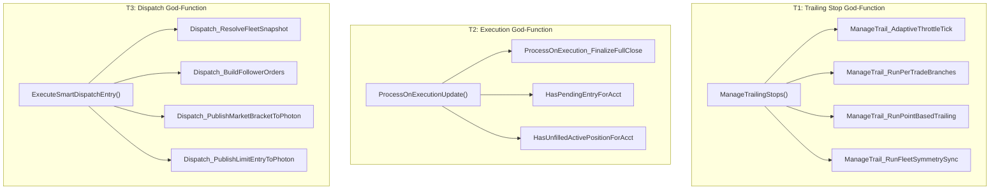

# Refactoring Approach: Phase 6 Hot Path Hardening

# Refactoring Approach -- Phase 6 Hot Path Hardening

<user_quoted_section>Builds on: (Epic Brief) and (Refactoring Analysis). Locks in: A1=C (T2 -> ProcessOnExecutionUpdate cluster), A2=A (no new tests), A3=A,D,E (T1+T3 boundaries OK; T2 redrawn), A4=A,C (no DRY of Photon publish; barrier inside helper), A5=C (pre-merge roadmap row only).</user_quoted_section>

## 1. Key Decisions

### 1.1 Structure

| Decision | Choice | Rationale | Trade-offs |
| --- | --- | --- | --- |
| Decomposition principle | **By execution phase** within each god-function (throttle/branch/sync for T1; cluster-shared-helper for T2; guard/build/publish for T3) | Mirrors the time-ordered control flow already present in code; each new helper takes a contiguous LOC range from the parent. | Slightly more helpers than a domain-cut would produce, but each is independently grep-able and CYC-verifiable. |
| Granularity | **11 tickets total** = 1 pre-merge doc + 4 T1 + 1 T2 + 4 T3 + 1 final-acceptance-with-docs | Stays within the user-approved "3-4 per target" envelope (Q4 alignment) and the AGENTS.md "minimum code that solves the problem" rule. T2 collapses to 1 ticket because Phase 5 already extracted most of the cluster. | If a sub-handler busts the 150 KB diff cap mid-flight, we sub-split that single ticket without re-planning the whole epic. |
| Placement | **Same-file extraction for all three targets** | Minimizes diff (no whole-method moves across files), preserves grep locality for operations, matches Phase 4 dispatcher precedent (`ProcessOnStateChange` -> 5 handlers in same `Lifecycle.cs`). | No new partial files. Co-location into existing siblings (`Trailing.Breakeven.cs` etc.) is permitted but NOT required. |
| New file count delta | **0** | Per above. | None. |

### 1.2 Transition

| Decision | Choice | Rationale |
| --- | --- | --- |
| Strategy | **Incremental per-cluster** | Each ticket leaves the file in a working, sync-able state. |

## 2. Target State

## 3. Scope of Tickets

**T1.A ManageTrail_AdaptiveThrottleTick**
- Lines 41-78 extraction.
- Owns throttle math, circuit breaker reset, and stale-pending cleanup call.

**T1.B ManageTrail_RunPerTradeBranches**
- Lines 98-251 extraction.
- Owns specialized TREND (E1/E2) and RETEST EMA-based branches.

**T1.C ManageTrail_RunPointBasedTrailing**
- Lines 260-335 extraction.
- Owns the frequency check and the point-based BE/T1/T2/T3 cascade.

**T1.D ManageTrail_RunFleetSymmetrySync**
- Lines 340-445 extraction.
- Owns the SIMA fleet sync pass and the post-sync Shadow check.

**T2.A ProcessOnExecution_FinalizeFullClose**
- Lines 120-180 extraction (shared across Trim and Target fill paths).
- Also extracts `HasPendingEntryForAcct` and `HasUnfilledActivePositionForAcct` predicates.

**T3.A Dispatch_ResolveFleetSnapshot**
- Lines 99-141 extraction.
- Owns fleet enumeration and active-account snapshot.

**T3.B Dispatch_BuildFollowerOrders**
- Lines 159-254 extraction.
- Owns per-account order building, parity scaling, and FSM registration.

**T3.C Dispatch_PublishMarketBracketToPhoton**
- Lines 257-465 extraction.
- Owns the Market entry branch + memory barrier + ring publish logic.

**T3.D Dispatch_PublishLimitEntryToPhoton**
- Lines 466-573 extraction.
- Owns the Limit entry branch + memory barrier + ring publish logic.

## 4. Acceptance Checklist (Verbatim Grep)

Verification for each ticket MUST include:
1. `dotnet build .\Linting.csproj`
2. `python check_ascii.py`
3. `grep -rn "(!)" src/` -- confirm no Unicode markers.
4. `grep -rn "Print(" src/` -- confirm byte-identical logs.
